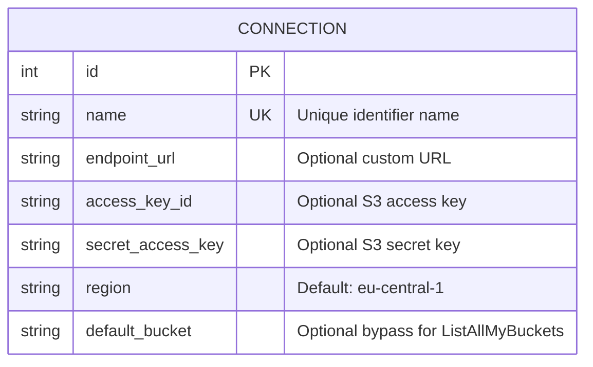

# Project Memory: S3 Web Browser

> **Project Memory Document**  
> *Last Updated:* September 2026  
> *Purpose:* Comprehensive knowledge base for human engineers, AI agents, and contributors to understand the design, architecture, patterns, decisions, and history of the S3 Web Browser project.

---

## 1. Executive Summary

**S3 Web Browser** is a lightweight, responsive web application built with **Flask**, **SQLAlchemy**, and **Boto3**. It provides a web-based file management interface for AWS S3 and any S3-compatible object storage (e.g., MinIO, Wasabi, Ceph, Cloudflare R2, LocalStack).

### Key Value Proposition
- **Multi-Tenant / Multi-Connection:** Supports multiple S3 endpoints and account credentials stored in an embedded SQLite database.
- **Zero-Config Deployment:** Automatic instance directory and SQLite database initialization upon startup.
- **S3-Compatible:** Configured for `s3v4` signature version and path-style addressing.
- **High-Performance S3 Operations:** Asynchronous on-demand folder size calculations via Python `ThreadPoolExecutor`, streaming chunked downloads, and on-the-fly streaming ZIP archiving.
- **Modern User Experience:** Material Design 3 (M3) styling, native dark/light mode toggle with preference persistence, drag-and-drop file upload, and clipboard integration.

---

## 2. System Architecture

```mermaid
graph TD
    User["Web Browser Client"]
    Flask["Flask Application (s3_web_browser)"]
    SQLite["SQLite Database (instance/connections.db)"]
    Boto3["AWS Boto3 Client / Resource"]
    S3Endpoints["S3 Storage (AWS S3 / MinIO / Wasabi)"]

    User -->|HTTP Requests| Flask
    Flask -->|CRUD Connections| SQLite
    Flask -->|S3 API Calls| Boto3
    Boto3 -->|S3 REST API (v4 Signature, Path-style)| S3Endpoints
    Flask -->|HTML / JSON / Streaming Responses| User
```

### Application Lifecycle & Factory
The application employs Flask's Application Factory pattern in [`s3_web_browser/__init__.py`](file:///Z:/Projects/WebsiteProjects/s3-web-browser/s3_web_browser/__init__.py):
1. Loads settings from [`config.Config`](file:///Z:/Projects/WebsiteProjects/s3-web-browser/config.py).
2. Suppresses OS errors while creating the instance path `instance/` (`contextlib.suppress(OSError)`).
3. Binds SQLAlchemy to the app via `db.init_app(app)` and creates missing tables with `db.create_all()`.
4. Registers routes via `register_routes(app)` from [`s3_web_browser/routes.py`](file:///Z:/Projects/WebsiteProjects/s3-web-browser/s3_web_browser/routes.py).

---

## 3. Database Schema & Models

Implemented in [`s3_web_browser/models.py`](file:///Z:/Projects/WebsiteProjects/s3-web-browser/s3_web_browser/models.py) using SQLAlchemy 2.0 mapped columns:



### Connection Helper: `to_boto3_kwargs()`
Translates the database model attributes into kwargs consumed by `boto3.client("s3", **kwargs)` or `boto3.resource("s3", **kwargs)`:
- Sets `signature_version="s3v4"`
- Sets `s3={"addressing_style": "path"}`
- Dynamically includes `endpoint_url` if defined.

---

## 4. API & Route Registry

| Method | Path | Controller | Description |
| :--- | :--- | :--- | :--- |
| `GET` | `/` | `index` | Displays saved connections cards. |
| `GET, POST` | `/connections/new` | `new_connection` | Displays form or creates a new S3 connection. |
| `GET, POST` | `/connections/<id>/edit` | `edit_connection` | Modifies connection. Preserves secret if left blank. |
| `POST` | `/connections/<id>/delete` | `delete_connection` | Removes connection from SQLite DB. |
| `GET` | `/c/<id>/buckets` | `buckets` | Lists S3 buckets. If `default_bucket` is set, redirects to that bucket. |
| `GET` | `/c/<id>/buckets/<bucket>/<path>` | `view_bucket` | Hierarchical folder navigation (`Delimiter="/"`) with pagination. |
| `GET` | `/c/<id>/search/buckets/<bucket>/<path>` | `search_bucket` | Recursive object search filtered by `search` parameter. |
| `GET` | `/c/<id>/size/buckets/<bucket>/<path>` | `get_bucket_size` | Calculates folder/bucket size asynchronously via `ThreadPoolExecutor`. |
| `GET` | `/c/<id>/download/buckets/<bucket>/<path>` | `download_file` | Streams file chunks (4KB) with `Content-Disposition: attachment`. |
| `POST` | `/c/<id>/upload/buckets/<bucket>/<path>` | `upload_file` | Handles multipart file upload to S3 prefix. |
| `POST` | `/c/<id>/delete/buckets/<bucket>/<path>` | `delete_file` | Deletes single object key via Boto3. |
| `GET` | `/c/<id>/download-zip/buckets/<bucket>/<path>` | `download_zip` | Bundles folder into a zip file on the fly; sets `download_started=1` cookie. |

---

## 5. Key Workflows & Engineering Details

### 5.1. Asynchronous Parallel Folder Size Calculation
- **Problem:** Computing the total size of an S3 folder requires recursive listing of all objects under the prefix. For large directories, synchronous calculation blocks page loading.
- **Solution:**
  1. Size calculation is decoupled from initial page render and triggered on-demand via a "Calculate Folder Size" button.
  2. The endpoint [`get_bucket_size`](file:///Z:/Projects/WebsiteProjects/s3-web-browser/s3_web_browser/routes.py#L223-L280) lists immediate contents and delegates recursive size aggregation of subfolders to a `ThreadPoolExecutor(max_workers=10)` using `as_completed()`.
  3. Returns human-readable (`humanize.naturalsize`) and byte figures as JSON.

### 5.2. File Upload (Drag-and-Drop + Multi-Select)
- Client-side drag-and-drop listener over window in [`bucket_contents.html`](file:///Z:/Projects/WebsiteProjects/s3-web-browser/s3_web_browser/templates/bucket_contents.html).
- Uploads files sequentially to avoid saturating HTTP sockets or exceeding upload timeouts.
- Uses SweetAlert2 and the top NProgress bar for visual feedback.

### 5.3. Folder Streaming ZIP Archiving
- [`download_zip`](file:///Z:/Projects/WebsiteProjects/s3-web-browser/s3_web_browser/routes.py#L341-L382) initializes a temporary zip file via `tempfile.NamedTemporaryFile(suffix=".zip")`.
- Iterates over all keys under the folder prefix using `paginator.paginate()`.
- Reads chunks (64KB) from S3 object bodies and streams them into `zipfile.ZipFile`.
- Emits response cookie `download_started=1` so the frontend SweetAlert2 modal can automatically close when browser download begins.

---

## 6. Development, Linters & CI/CD

### Dependency Management
- Managed with **Poetry** (`pyproject.toml`).
- Core dependencies: `flask`, `flask-sqlalchemy`, `boto3`, `botocore`, `gunicorn`, `humanize`.
- Dev dependencies: `ruff`.

### Ruff Configuration
Strict linting is configured in [`pyproject.toml`](file:///Z:/Projects/WebsiteProjects/s3-web-browser/pyproject.toml):
- Target Python: `py312`.
- Maximum line length: 120.
- **Absolute imports mandatory:** `flake8-tidy-imports.ban-relative-imports = "all"`.
- Complexity limits: McCabe max-complexity = 10, Pylint max-statements = 80, max-branches = 20.

### GitHub Actions
- `ruff.yml`: Runs `ruff check .` on all branch pushes.
- `codeql-analysis.yml`: Automated security scanning.
- `dependabot_updates.yml` & `dependabot.yml`: Automated dependency updates.
- `github_release.yml` & `pypi_deploy.yml`: Release and PyPI publishing automation on version tag pushes (`v*`).

---

## 7. Operational Runbook

### Docker Deployment
```bash
# Build image locally
docker build -t s3-web-browser .

# Run with persistent volume (Crucial for SQLite database retention)
docker run -d \
  --name s3-browser \
  -p 8000:8000 \
  -v ${PWD}/instance:/usr/src/app/instance \
  s3-web-browser
```

### Environment Variables
| Variable | Default | Purpose |
| :--- | :--- | :--- |
| `SECRET_KEY` | `your_default_secret_key` | Flask session secret (set a random string in production). |
| `DEBUG` | `False` | Toggle Flask debug mode. |
| `PAGE_ITEMS` | `300` | S3 items listed per page. |
| `SQLALCHEMY_DATABASE_URI` | `sqlite:///connections.db` | Path or URI to SQLite database. |

---

## 8. Architectural Evolution & History

1. **Phase 1 (Legacy):** Single connection defined via `.env` file and `AWS_*` environment variables.
2. **Phase 2 (v1.2.0 - SQLite Multi-Connection):**
   - Replaced `.env` with embedded SQLite `instance/connections.db`.
   - Created UI for connection management (`/connections/new`, `/connections/<id>/edit`, `/connections/<id>/delete`).
   - Implemented `default_bucket` to support restricted IAM permissions without `ListAllMyBuckets`.
3. **Phase 3 (Performance & Polish):**
   - Implemented on-demand size calculation to prevent long page load stalls.
   - Added multithreaded `ThreadPoolExecutor` for folder size calculation.
   - Migrated styling to Material Design 3 (M3) with full Light/Dark mode and drag-and-drop uploads.

---

## 9. Future Roadmap & Recommendations for Next Engineers

1. **Automated Test Suite:**
   - Add unit and integration tests using `pytest`, `pytest-flask`, and `moto` (for mocking S3).
   - Add tests for `parse_responses`, `to_boto3_kwargs`, and connection CRUD routes.
2. **Folder Upload & Recursive Deletion:**
   - Support uploading directory trees (`webkitdirectory`).
   - Add confirmation modal and batch deletion logic for non-empty folders.
3. **Credential Encryption at Rest:**
   - Consider encrypting `secret_access_key` in SQLite using `cryptography` (Fernet) keyed by `SECRET_KEY`.
4. **Enhanced Search:**
   - Migrate in-memory substring search to regex or prefix-based S3 queries for deep trees.
