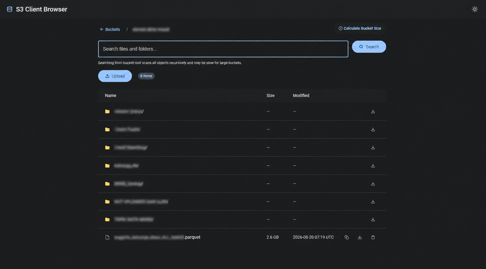

# S3 Web Browser

[](https://python.org)

[](https://github.com/Jenusdy/s3-web-browser/stargazers)


S3 Web Browser is a Flask-based web application that allows users to browse AWS S3 buckets and their contents via a simple web interface. It leverages Boto3, AWS's SDK for Python, to interact with S3.




## Features

- **Multiple Connections**: Add and manage multiple S3 endpoints securely through the web UI (saved in a local SQLite database).
- **List S3 Buckets**: View all S3 buckets available to a specific connection in a card-based grid layout.
- **Default Buckets**: Configure a default bucket to bypass global listing for environments with restricted permissions.
- **Browse Bucket Contents**: Navigate through folders and files with breadcrumb navigation.
- **Upload Files**: Easily upload multiple files directly into your S3 buckets and folders via drag-and-drop or file selection.
- **Download Files & Folders**: Download individual objects securely via temporary presigned URLs, or download entire folders as ZIP archives on the fly.
- **Dynamic Folder Sizes**: Asynchronously calculate total folder sizes with blazing fast parallel execution without blocking the UI.
- **Search Bucket Contents**: Recursively search for files and folders within any bucket or subdirectory (case-insensitive).
- **Pagination**: Browse large buckets efficiently with configurable page sizes.
- **Copy S3 Paths**: One-click copy of S3 paths (`s3://bucket/key`) to clipboard.
- **Modern Material Design 3 UI**: Enjoy a beautiful, highly responsive user interface with dynamic animations and seamless Light/Dark mode support.

## Configuration

Connection credentials (AWS keys, endpoint, region) are **managed securely through the Web UI** and saved to a local SQLite database (`instance/connections.db`).

Application-level settings can still be configured via environment variables:

| Variable | Default | Description |
|---|---|---|
| `SECRET_KEY` | `your_default_secret_key` | Flask session secret key |
| `DEBUG` | `False` | Flask debug mode |
| `PAGE_ITEMS` | `300` | Items per page |
| `SQLALCHEMY_DATABASE_URI` | `sqlite:///connections.db` | Database URI for storing connections (Defaults to `instance/connections.db`) |

*Note: The old `.env` file and `AWS_*` environment variables are now completely obsolete and have been removed. The database file is **automatically created** on fresh installs when the app first starts.*

## Run

### Docker (pre-built image)

```bash
# Mount the instance directory to persist your database!
docker run -it --rm -p 8000:8000 -v ${PWD}/instance:/usr/src/app/instance Jenusdy/s3-web-browser
```

### Docker (build locally)

1. `mkdir -p instance`
2. `docker build -t s3-browser .`
3. `docker run -it --rm -p 8000:8000 -v ${PWD}/instance:/usr/src/app/instance s3-browser`
4. Open http://127.0.0.1:8000/

## Development

1. Install dependencies: `poetry install`
2. Run code quality checks: `make cq`
3. Run tests: `make test`
4. Start the app: `poetry run python run.py`
5. Open http://127.0.0.1:8000/
6. Click "+ Create your first connection" to add your S3 credentials via the UI.

### Makefile targets

| Target | Description |
|---|---|
| `make install` | Install dependencies via Poetry |
| `make cq` | Run linter and formatter (Ruff) |
| `make test` | Run tests |
| `make all` | Install, lint, and test |
| `make clean` | Remove temporary files |
| `make release VERSION=x.y.z` | Build and push Docker images |


## License

This project is licensed under the MIT License - see the LICENSE file for details.

## Acknowledgements

- Flask for providing the web framework.
- AWS Boto3 for interfacing with Amazon S3.
